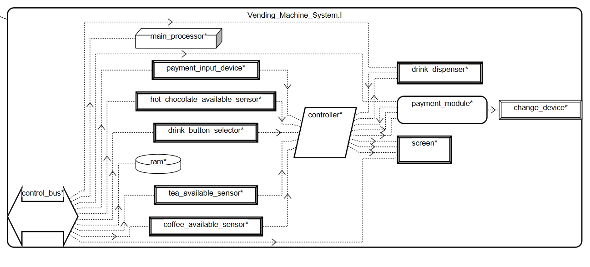
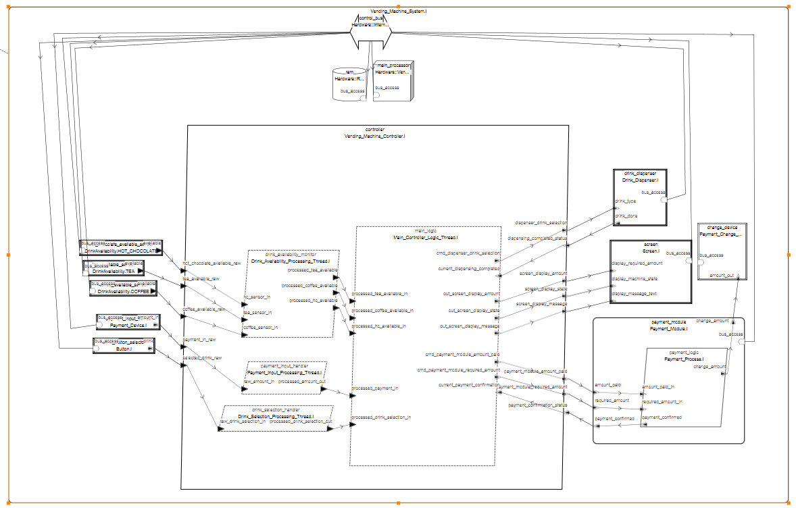

Aleksandra Fąfara | email: olafafara@student.agh.edu.pl

# Automat do kawy obsługujący napoje 

## Opis dla użytkownika
Automat ma do wyboru skończoną ilość napojów do zamówienia. Aby dokonać zakupu użytkonik musi jeden z napojów widoczych na przyciskach automatu. Jeżeli napój nie jest dostępny pojawi się odpowiednie powiadomienie. W przeciwnym przypadku automat czeka na płatność i po potwierdzeniu jej zwraca napój i resztę.

## Opis komponentów AADL z komentarzem
    - *system* Vending_Machine_System: gółwny komponent automatu, zawiera wszystkie inne komponenty

    - *process* Vending_Machine_Controller: główny proces zarządzający automatem, składa się z 4 wątków: payment_input_handler (do czytania ile użytkownik włożył pieniędzy do automatu), drink_availability_monitor (do sprawdzania dostępności danego napoju), drink_selection_handler (do odczytywania jaki napój wybrał użytkownik) oraz main_logic (zarządza uprzednio wymienionymi wątkami)

    - *thead* Main_Controller_Logic_Thread: zajmuje się pobieraniem i przekiedowywaniem informacji z wszystkich innych wątków systemu oraz przekazywaniem ich do odpowiednich endpointów

    - *system* Payment_Module: posystem zajmujący się sprawdzaniem czy odpowiednia ilość monet została wrzucona do automatu oraz za obliczanie i zwracanie reszty

    - *process* Payment_Process: główny process podsystemu Payment_Modlule, zajmuje się zarządzaniem wątkami i urządzeniami podsystemu

    - *thread* Payment_Input_Processing_Thread: główny wątek processu Payment_Process

    - *device* Payment_Device: urządzenie sensorycze służące do sprawdzania ilości pieniędzy wrzuconych przez użytkownika

    - *device* Drink_Dispenser: podsystem automatu służący do wydawania napoi

    - *device* Screen: urządzenie służące do pokazywania użytkownikowi potrzebnej do zakupienia sumy oraz wiadomości zwracanej przez maszynę (np, że napój jest gotowy)

    - *device* Button: urządzenie do wybierania rodzaju napoju
    
    - *device* DrinkAvailability: urządzenie sensoryczne do sprawdzania dostępności napoju, ma 3 implementacje: do COFFEE, HOT_CHOCOLATE, TEA

    - *thread* Drink_Availability_Processing_Thread: wątek zarządzający urządzeniem DrinkAvailability

    - *thread* Drink_Selection_Processing_Thread: wątek zarządzający urządzeniem Button

## Ogólny diagram komponentów automatu do napojów 

## Pełny diagram komponentów

## Raporty:
1. Weight totals Report

control_bus: [L] Sum of weights / gross weight is 0.050 kg (no limit specified)

coffee_available_sensor: [L] Sum of weights / gross weight is 0.150 kg (no limit specified)

tea_available_sensor: [L] Sum of weights / gross weight is 0.150 kg (no limit specified)

hot_chocolate_available_sensor: [L] Sum of weights / gross weight is 0.150 kg (no limit specified)

payment_input_device: [L] Sum of weights / gross weight is 0.500 kg (no limit specified)

drink_button_selector: [L] Sum of weights / gross weight is 0.300 kg (no limit specified)

screen: [L] Sum of weights / gross weight is 0.800 kg (no limit specified)
change_device: [L] Sum of weights / gross weight is 0.500 kg (no limit specified)

Warning! drink_dispenser: [L] No net weight plus subcomponent weight or no gross weight

ram: [L] Sum of weights / gross weight is 0.010 kg (no limit specified)
main_processor: [L] Sum of weights / gross weight is 0.150 kg (no limit specified)

Warning! payment_module: [L] No net weight plus subcomponent weight or no gross weight

Vending_Machine_System_I_Instance: [L] Sum of weights / gross weight is 2.760 kg (no limit specified)

## Literatura:
https://github.com/GaloisInc/CASE-AADL-Tutorial/blob/main/aadl_book/chapter1_aadl_basics/README.md

https://osate.org/about-osate.html

Kurs Systemy Czasu Rzeczywistego na platoformie UPeL
